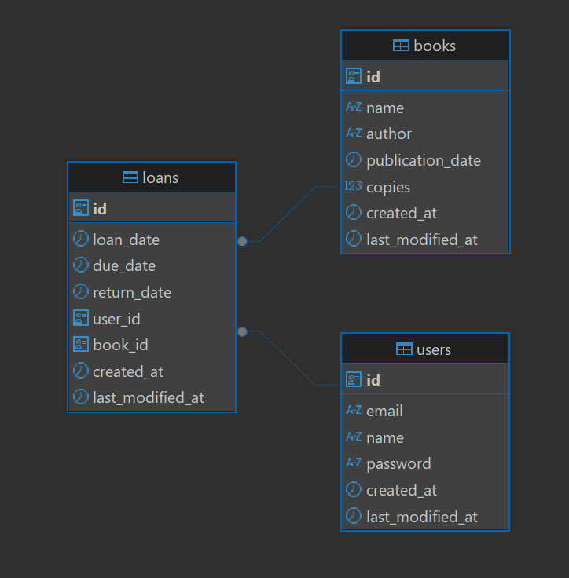

A Library Management REST API done in Spring Boot to manage users, books and loans in a modern and secure way.
The system implements:

- The Spring Security framework for security with a JWT implementation. Users receive a JWT token when reaching the auth/login
  endpoint with correct credentials. JWTs expire after 1hour.
- A Controller-Service-Repository design indicated by Spring.
- ModelMapper and DTOs to ensure that the requests and responses are done in a structured and DRY way.
- A GlobalExceptionHandler and custom exceptions for different business rules.
- Caching with redis.
- User roles: ADMIN or USER.

_Done in Spring 3.5.7, Java 21, Docker, Flyway and Maven with Postgres as database and Redis as caching._

### How to run

Create and configure the ``.env`` file:

```
POSTGRES_USER=
POSTGRES_PASSWORD=
POSTGRES_DB=
DB_HOST=
DB_PORT=5432

REDIS_HOST=
REDIS_PORT=

JWT_SECRET=
JWT_EXPIRATION=

APP_PORT= 
```

Run a Postgres and Redis instance. The docker-compose file has everything
you need to build them using ``docker-compose up`` and then run the Spring instance locally. Alternatively, you can just run
everything in a container with `docker-compose --profile prod up --build`.

### Business rules

1. Users can't borrow a loan if there are no available copies of the book. Each time a book is borrowed, their copies get reduced
   by 1. When
   books are returned, their copies increase by 1.
2. Each user has a limit of 3 active loans.
3. Users can have a USER or ADMIN role.

Users can get their user info and loans by `/users/me` and `/loans/me` respectively.



**WARNING**: the `aplications-prod.properties` properties that disable swagger are commented out to be able to see the docs in
prod.